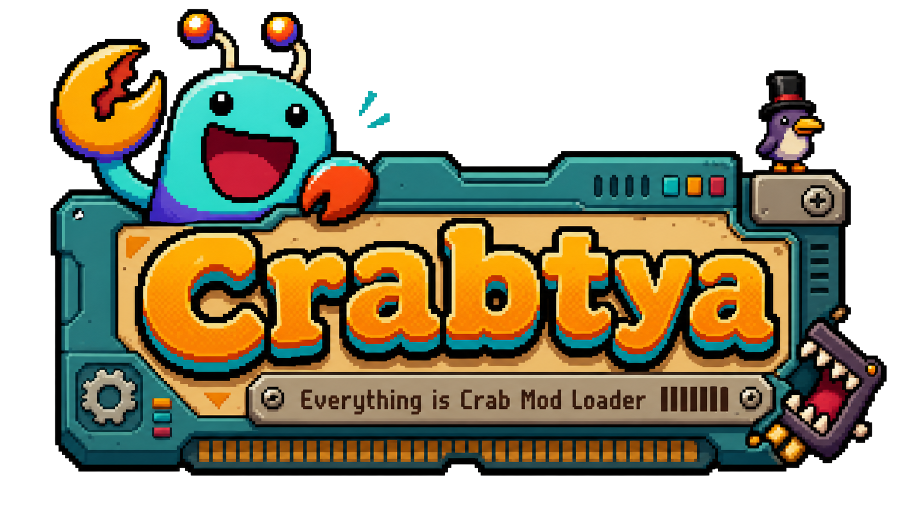

<p align="center">
  
</p>

<p align="center">
  <b>Crabtya</b> is a folder-based mod loader for <i>Everything is Crab</i>.
</p>

<p align="center">
  Drop a mod folder into <code>Mods/&lt;mod-id&gt;/</code>, launch the game, done.
</p>

---

## For Players

### Install

1. Download `EverythingIsCrab.ModLoader-v1.0.0.zip` from the [Releases](../../releases) page.
2. Close the game.
3. Extract the zip to a temporary folder.
4. Open PowerShell in that folder and run:
   ```powershell
   .\Install-Crabtya.ps1 -GamePath "C:\path\to\Everything is Crab"
   ```
5. Launch the game. The main menu shows a `Crabtya v1.0.0` badge top-right.

> **Manual install:** extract the zip directly into the folder beside `Everything is Crab.exe` so `BepInEx/` and `dotnet/` land beside the executable.

### Uninstall

```powershell
.\Uninstall-Crabtya.ps1 -GamePath "C:\path\to\Everything is Crab"
```

Or manually remove: `BepInEx/`, `dotnet/`, `winhttp.dll`, `doorstop_config.ini`, `.doorstop_version`, `changelog.txt`.

### Install a Mod

1. Download the mod zip (e.g. `faniel.mousewheel-zoom-1.0.0.zip`).
2. Extract it into `Mods/` inside your game folder. The manifest must land at `Mods/<mod-id>/eicmod.json`.
3. Launch the game. Open the `MODS` button on the main menu to enable/configure mods.

### Mods UI

- **Main menu** — `MODS` button opens the Crabtya Mods settings window.
- **Pause / start menu** — `MOD SETTINGS` entry opens the same window in-run.
- Content-only mods toggle live. DLL/bundle mods show `(restart)` and apply on next launch.

### Safe Mode

If a mod breaks the game, launch with `--eic-safe-mode` or place an `eic-safe-mode.flag` file beside the executable. Safe mode skips all mod loading.

---

## Included Mods

| Mod | What it does |
|---|---|
| `faniel.mousewheel-zoom` | Scroll wheel zooms the camera. Includes an **Invert Scroll** toggle. |
| `faniel.fov-slider` | Slider for gameplay field-of-view. |
| `faniel.ui-scale` | Slider to shrink or grow the UI (0.5×–1.15×). Live without restart. |
| `faniel.no-intro` | Skips the opening cinematic. |
| `faniel.dll-sample` | Reference DLL entrypoint mod. |
| `faniel.mvp-sample` | Minimal content-only reference mod. |

Each is packaged as a separate zip on the [Releases](../../releases) page.

---

## For Mod Makers

### Quickstart

See [`docs/mod-makers/quickstart.md`](docs/mod-makers/quickstart.md) — covers content mods, DLL mods, and bundle mods end to end.

### Starter Templates

Extract a template from the release zip (`templates/` folder) or grab it standalone:

- **`content-mod-template`** — declarative-only mod, no C# required.
- **`dll-mod-template`** — C# entrypoint using `Crabtya.ModApi`.

### Manifest Format

Every mod needs `eicmod.json` in its folder. Full reference: [`docs/mod-makers/manifest-format.md`](docs/mod-makers/manifest-format.md).

Minimal example:

```json
{
  "id": "author.my-mod",
  "name": "My Mod",
  "version": "1.0.0",
  "author": "you",
  "description": "Does a thing.",
  "targetGame": "Everything is Crab",
  "loaderVersion": "1.x",
  "content": {
    "definitions": ["defs/my-def.json"]
  }
}
```

### Supported Definition Types

| Type | What it does |
|---|---|
| `balancePatch` | Adjust player or enemy stats. Supports `player.stat.*`, `enemy.stat.*`, `enemy.<archetype>.stat.*`. |
| `cameraPatch` | Override orthographic camera size. Add slider metadata for a settings UI row. |
| `uiScale` | Override UI element scale. Add slider metadata for a settings UI row. |
| `localization` | Add or replace localized strings. |
| `visual` | Swap sprites. Targets: `player.baseSprite`, `enemy.baseSprite`, `gameobject.named:<name>`, `sprite.named:<name>`. |
| `introSkip` | Skip the opening cinematic. |
| `content.assetBundles` | Load a Unity AssetBundle at startup. See [`docs/mod-makers/asset-workflow.md`](docs/mod-makers/asset-workflow.md). |

### DLL Mods

Implement `Crabtya.ModApi.ICrabtyaMod` and declare both `assemblies` and `entrypoints` in your manifest. Reference `Crabtya.ModApi.dll` from the loader package. See the template and [`docs/mod-makers/quickstart.md`](docs/mod-makers/quickstart.md).

### Runtime Safety

Crabtya redirects all save IO and blocks Steam achievement writes during modded sessions. Player data is isolated to `CrabtyaData/IsolatedSave/` and never touches the base-game save space.

---

## For Contributors

### Build

```powershell
dotnet build loader/EIC.ModLoader/EIC.ModLoader.csproj -c Release
```

The build deploys `EIC.ModLoader.dll` and `Crabtya.ModApi.dll` to `game/BepInEx/plugins/`.

### Package

```powershell
.\tools\package-release.ps1 -ReleaseLabel "v1.0.0" -Clean `
    -ModId faniel.dll-sample,faniel.fov-slider,faniel.mousewheel-zoom,faniel.mvp-sample,faniel.no-intro,faniel.ui-scale
```

Artifacts land in `packages/`. See [`packages/README.md`](packages/README.md).

### Key Docs

| Doc | Purpose |
|---|---|
| [`AGENTS.md`](AGENTS.md) | Agent operating rules and repo constraints |
| [`PLAN.md`](PLAN.md) | Master job board and current release status |
| [`docs/development/architecture.md`](docs/development/architecture.md) | Runtime architecture and component ownership |
| [`docs/development/agent-handoff.md`](docs/development/agent-handoff.md) | Latest session status and residual risks |
| [`docs/development/jobs/`](docs/development/jobs/) | Per-job implementation plans |

### What Not to Commit

See [`.gitignore`](.gitignore). In particular:
- Never commit game binaries, `Everything is Crab_Data/`, or `dotnet/`.
- Never commit `game/Mods/mod-state.json`, `startup-commands.json`, or `runtime-settings.json` — these are runtime state.
- Never commit `game/CrabtyaData/` — this is isolated save data.
- `opencode.json` is machine-specific; keep it local.

---

## Repo Status

Crabtya v1 is feature-complete. See [`PLAN.md`](PLAN.md) for current job status and release gating.

## Post-v1: Crabtya Lite

Crabtya Lite is planned as a separate post-v1 product for players who want a curated QoL package without arbitrary mod loading.

- Lite is intended to cover built-in FOV, mouse-wheel zoom, invert scroll, and No Intro behavior on the main game install.
- Lite is not a runtime mode flag for full Crabtya; it should ship as its own package and release choice.
- Users should choose either full Crabtya or Crabtya Lite from Releases unless compatibility is explicitly tested and documented.
- A GitHub Pages site is later polish, not part of the immediate Crabtya v1 release work.
